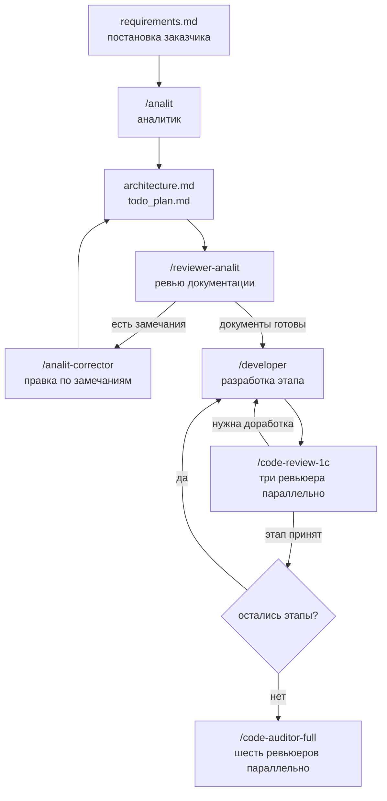

# 1c_vibecoding_agents

> **In English.** A set of Claude Code commands, subagents and skills that takes a 1C:Enterprise task from the customer's requirements to reviewed code. An analyst writes the architecture and a staged plan, a reviewer checks these documents, a developer implements the plan stage by stage, and up to six narrow reviewers audit the code in parallel. All prompts are written in Russian. The rest of this page is in Russian.

Команды, субагенты и скиллы для Claude Code, которые ведут задачу по 1С от постановки заказчика до проверенного кода. У каждой роли свой промпт, своя модель и свои права: аналитик не пишет код, ревьюеры ничего не правят.

## Как идёт задача



Каждый шаг запускаете вы. Агенты не передают работу друг другу сами: результат шага лежит в файле, вы его читаете и решаете, идти дальше или вернуть на доработку.

## Что внутри

### Команды

| Команда | Что делает | Модель |
| --- | --- | --- |
| `/analit FT-123` | Аналитик. Читает `requirements.md`, задаёт уточняющие вопросы, пишет `architecture.md` и `todo_plan.md` | opus |
| `/reviewer-analit FT-123` | Ревьюер документации. Проверяет, что документы аналитика покрывают требования и не спорят со стандартами 1С и БСП. Замечания по критичности пишет в `techdocs_review_results.md` | opus |
| `/analit-corrector FT-123 strong` | Аналитик-корректор. Правит документы по замечаниям ревьюера. `strong` разбирает все замечания, `light` пропускает низкие и незначительные | opus |
| `/developer FT-123 2` | Разработчик. Выполняет этап 2 из `todo_plan.md` и отмечает сделанные пункты | sonnet |

### Скиллы

| Скилл | Что делает | Модель |
| --- | --- | --- |
| `code-review-1c` | Ревью этапа. Запускает параллельно `bsp-reviewer`, `query-reviewer` и `ux-reviewer`, сводит три отчёта в `code_review_results.md` | sonnet |
| `code-auditor-full` | Полный аудит перед тестированием. Запускает параллельно шесть ревьюеров, результат пишет в `code_audit_results.md` | sonnet |
| `reviewer-analit` | То же ревью документации, что и команда. Номер задачи берёт из контекста, если его не назвали | opus |
| `git-committer` | Пишет сообщение коммита в формате `FT-123 feat: ...` | haiku |
| `pdf-markitdown` | Переводит PDF в Markdown через Microsoft MarkItDown | sonnet |
| `ai-tools-audit` | Проверяет исправность папки `.claude/`: описания скиллов, ссылки, хуки, доступность программ | модель сессии |
| `nachalo-sessii`, `zavershenie-sessii` | Открывают и закрывают рабочую сессию: читают память проекта и записывают в неё решения | модель сессии |

### Субагенты

Ревьюеры работают только на чтение: им доступны `Read`, `Grep` и `Glob`.

| Субагент | Что проверяет | Модель |
| --- | --- | --- |
| `bsp-reviewer` | Разметку модулей, области, именование, программный интерфейс БСП, устаревшие методы | sonnet |
| `query-reviewer` | Тексты запросов: синтаксис, соединения, индексы, временные и виртуальные таблицы | opus |
| `ux-reviewer` | Управляемые формы: группировки, условное оформление, путь пользователя | opus |
| `performance-reviewer` | Узкие места на стыках модулей: запросы в цикле, повторное чтение данных | opus |
| `architect-reviewer` | Дубли между модулями, нарушения слоёв, лишние зависимости | opus |
| `warning-reviewer` | Обработку ошибок: пустые исключения, пропущенные проверки, незакрытые транзакции | sonnet |
| `tools-auditor` | Сверяет инструменты в промпте команды, скилла или агента со списком разрешённых | haiku |

## Быстрый старт

Нужны Claude Code (расширение для VS Code или консольная версия), Git и исходники конфигурации 1С в файлах, например проект EDT. Хук при старте сессии запускается через PowerShell и вызывает скрипт на Python.

1. Скопируйте в корень репозитория с вашей конфигурацией папку `.claude/`, папку `projects/` и файлы `CLAUDE.md` и `memory.md`.
2. В `CLAUDE.md` в разделе «Контекст проекта» замените платформу, конфигурацию, версию БСП и языки на свои.
3. В `.claude/settings.json` удалите блок `permissions`: в нём пути и разрешения с машины автора.
4. В `projects/code_style.md` запишите внутренние стандарты кода вашей команды. Файл пустой, его читает `bsp-reviewer`.
5. Создайте файл `projects/tasks/FT-001/requirements.md` и вставьте в него постановку задачи. Номер задачи пишется как `FT-` и цифры, команды проверяют этот формат.
6. Откройте репозиторий в Claude Code и пройдите цепочку:

```text
/analit FT-001
/reviewer-analit FT-001
/analit-corrector FT-001 light
/developer FT-001 1
/code-review-1c FT-001
```

После каждой команды откройте папку задачи и прочитайте, что в ней появилось.

## Папка задачи

Вся работа по задаче лежит в `projects/tasks/FT-xxx/`.

| Файл | Кто пишет |
| --- | --- |
| `requirements.md` | Вы: постановка и требования заказчика |
| `architecture.md` | `/analit`, правит `/analit-corrector` |
| `todo_plan.md` | `/analit`, пункты отмечает `/developer` |
| `techdocs_review_results.md` | `/reviewer-analit`, исправленное отмечает `/analit-corrector` |
| `code_review_results.md` | `code-review-1c` |
| `code_audit_results.md` | `code-auditor-full` |
| `CLAUDE.local.md`, `memory.md` | Вы и сессия: уточнения и память по задаче |

## Состояние проекта

Автор работает в таком окружении: платформа 8.3.27, EDT 2025.2.3, УТ 11.5 с БСП 3.8.2, VS Code в Windows.

`CLAUDE.md` описывает процесс шире, чем он собран в командах. Роли тестировщика и технического писателя в нём есть, команд для них пока нет.

## Автор

Стас Ганиев, Senior 1С-разработчик. Ведёт курс [«AI-арсенал для разработчика 1С»](https://cors.su/ai-arsenal-dlya-razrabotchika-1s/) и Telegram-канал [OneSCast](https://t.me/OneSCast).

## Лицензия

[MIT](./LICENSE)
